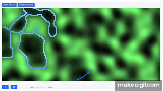

# OverlandFlow

## [Demo](http://sancarn.github.io/OverlandFlow/build)



This is a fork of TarVK's awesome [A* search web app](https://github.com/TarVK/TypeScript-React-path-finder).

## Long term project

Long term goal of this project is to integrate a more GIS style approach to OverLand flow routing, and return useful GIS information from the process.

Typical future file layout:

```
root
|- Lib
|  |- Custom libs
|
|- node_modules
|  |- Imported node modules
|
|- Lidar
|  |- lidar1.asc
|  |- lidar2.asc
|  |- lidar3.asc
|  |- ...
|
|- RoutingGoals
|  |- Points.shp      (to convert to GeoJSON)
|  |- Polylines.shp   (to convert to GeoJSON)
|  |- Polygons.shp    (to convert to GeoJSON)
|
|- Sources.csv
|- Config.json
|- Main.js

```

The application would ideally run in 2 modes:

1. Client Side Interactive mode - Show a GUI to the user displaying open street map, allowing users to specify sources for routing. Perform processing in the background and asynchronously return the results to the user.

2. Server Side Batch mode - Perform a large amount of analysis on hundreds of sources, provide data linking and return datasets in batch. 


## Important information

This is not a replacement for 2d hydraulic modelling. The above simulation assumes:

* There is an infinite volume of water spilling from the source
* 100% of the flow results in surface runoff, i.e. 0% of volume goes to depression storage.
* Water has no inertia (or very low velocity). You can construct scenarios where momentum/inertia should carry water over a low point (e.g. syphons). This algorithm will not show good results in these cases unless the terrain provides no other alternative.

This algorithm only provides an indication of which areas can flood. 

## Open source

This project is to be released as open source software with the intention of helping private and public water companies everywhere increase knowledge of their potential impact on the environment. Feel free to contribute and 

## Status of the project

Currently this project is just an idea, and implemented as a hack on top of TaqrVK's TypeScript-React-path-finder. Hopefully this project will be picked up for active development, as currently development is purely ad-hoc.
